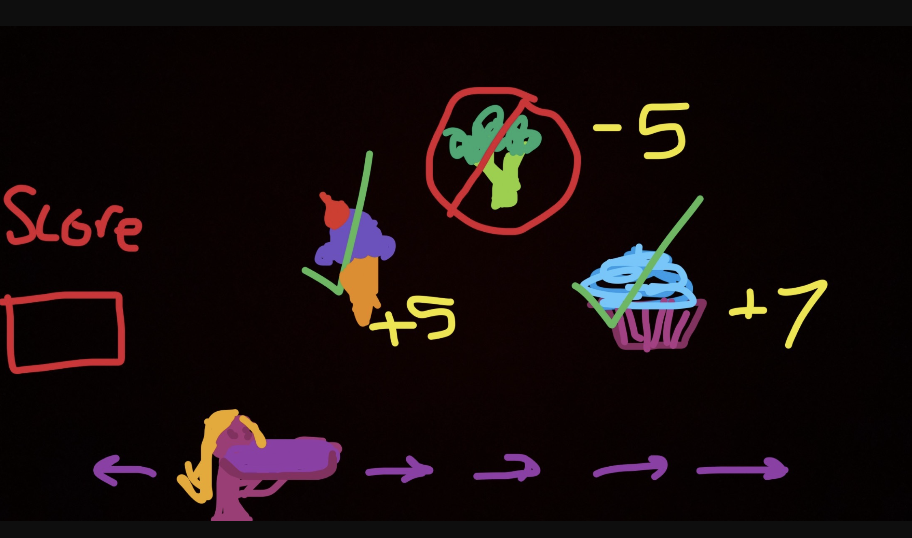

LINK TO SUPERMARKET SWEEP: https://emilykiss.github.io/EK-Game1/ 

HOW TO PLAY:
- Use your left and right arrow keys to move your shopper around the screen!
- Try and catch as many donuts as you can.
- Do NOT catch a tomato, as that will end your game.

OK LET'S GET INTO IT👀🥳👾
An elevator pitch of your game idea⛺️💪🏻
- I'm thinking of creating a catch game!
- The user will be tasked with catching good items while avoiding bad items
- Can do this with foods in the supermarket possibly (try to catch yummy junk food items avoid veggies🥦)
- Can also do this with clothing items and shopping bags🛍👗👠
- Points + or - depending on the item the player comes into contact with 

What tech stack you plan on using (example: using Tailwind for styling)
- HTML
- JS
- CSS
- very possibly Canvas 

Wireframes of your game

Drew this while thinking about food, but leaning toward the player catching clothing items.

MVP Goals
- player 
- obstacles that subtract points from the score
- losing message when points go below zero 
- items for the player to catch to increase their score
- start over button 

Stretch Goals
* Moving background
* Extremely stylized game
* High score list- input your name 

Any potential roadblock
* My lack of technical knowledge 
* Goals that are out of my league 
* Self doubt
* I have struggled with fully understanding DOM elements but my goal this weekend is heavilly reviewing 

Post-Project reflections
- At the start  of this project, I was unsure about my js capabilities.  After spending days using trial and error, researching topics, and looking back at old assignments, I became more and more confident.
- It was so exciting everytime I got something to work 
- Some challenges were harder than expected (adding and creating sprites) and some were easier (adding audios).
- I learned that sometimes, you just need to find the right resource that makes sense to you.
- I wanted to have a high score list, so I will try to add that in post project. 

Sources 
- https://www.geeksforgeeks.org/html5-game-development-infinitely-scrolling-background/
- https://www.youtube.com/watch?v=7JtLHJbm0kA
- https://www.youtube.com/watch?v=UdSVPgNkOyU
- https://elements.envato.com/
- https://www.youtube.com/watch?v=IlnZxLeQezI
- https://www.piskelapp.com/p/create/sprite
